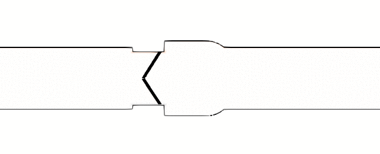

I am a Mechanical Engineer specialising in Computational Fluid Dynamics.
Currently working towards a PhD in [CITY, University of London](https://www.city.ac.uk/).

### Research
The subject of my PhD are cavitating flows with potential bio-engineering applications.

Cavitation is the phenomenon of vaporization of liquids, not through heating (boiling), but through acceleration. A ship propeller can accelerate the ambient water that abruptly and severely that the static pressure falls bellow the saturation value and the water turns to vapour. The induced vapour cavities turn back to liquid water after a short period, often following an implosion, which could damage mechanical structure and equipment.

The work is motivated by the potential of cavitation induction in blood flow through a prosthetic mechanical heart valve, reported by some experiments in the past.

In the past almost 4 years, I have been working in _CITY_, as part of an european research program, _CaFE_, focusing on cavitation erosion. In order to study the mechanical heart valve flow, I have been developing a CFD tool to accommodate the body motion of the valve leaflets in the computational fluid domain.

The tool follows the immersed boundary method, is generic and can be used in various applications, compressible or incompressible, turbulent or laminar, multi- or single-phase flows. This approach is ideal for modelling solids of complicated geometry or undergoing large displacement or deformation, avoiding the cumbersome mesh generation.

### Publications

The work throughout the PhD studentship resulted in few conference participations and journal paper publications.

**Peer-Reviewed Journal Publications**

- Stavropoulos-Vasilakis E., Malgarinos I., Koukouvinis P. and Gavaises M., _A direct forcing Immersed Boundary Method for Cavitating Flows_, _(In preparation)_

- Li Q., Stavropoulos-Vasilakis E., Koukouvinis P., Gavaises M. and Bruecker H. C. , March 2019, _Micro-pillar wall shear-stress measurements in the aortic arch with CFD-assisted calibration_, Journal of the Royal Society Interface, _(Submitted, awaiting editorial decision)_

- Stavropoulos-Vasilakis E., Kyriazis N., Koukouvinis P., Farhat M. and Gavaises M., 2019, [_Cavitation induction by projectile impacting on a water jet_](https://doi.org/10.1016/j.ijmultiphaseflow.2019.03.001), International Journal of Multiphase Flow, 114, pp.128-139

**Conferences**

- Stavropoulos Vasilakis E., Kyriazis N., Koukouvinis P., Farhat M. and Gavaises M., 2018, [_Cavitation Induction by Projectile Impacting on a Water Jet_](http://ebooks.asmedigitalcollection.asme.org/content.aspx?bookid=2565&sectionid=206551373), In Proceedings of the 10th International Symposium on Cavitation (CAV2018), ASME Press

- Participated in poster exhibition at IICR 4rth, 5th and 6th Cavitation Workshop ([2016](http://iicr2016.net/), [2017](http://iicr2017.net/), [2019](http://iicr2019.net/) respectively).

### Academic Background

I studied Mechanical Engineering in National Technical University of Athens ([NTUA](https://www.ntua.gr)).

In _NTUA_, I received a wide range of courses, following the default academic program, covering many fields of Mechanical Engineering, from fluid and structural dynamics to fundamentals of electronic circuits, control systems, energy engineering and bio-engineering. I then opted for the Air and Ground Transport Vehicles specialisation, where I focused on aerodynamics, flight dynamics and aerodynamic optimization.
My diploma thesis was a study of a truss structure for a deformable wind turbine blade, where the possibility of replacing the conventional beam structure of the blade by a truss with few actuators, that could deform the blade according to a control system.

### Work Experience

From October 2015 to October 2018, I was employed by CITY, University of London, as a Research Fellow in framework of [CaFE ITN project](http://cafe-project.eu/). _CaFE_ was an interdisciplinary project that investigated cavitation erosion. The work done then was part of my PhD and regarded mainly code development on [OpenFOAM](https://github.com/OpenFOAM/OpenFOAM-2.4.x).

In the past, I completed an internship in [ONERA](https://www.onera.fr) - The French Aerospace Laboratory, at the Applied Aerodynamics Department. There I worked on the development of a hybridization tool, which would merge numerical and experimental data, to benefit from the detail of numerical computations and the precision of aerodynamic experiments and provide more accurate pressure field information. The internship in _ONERA_ lasted from October 2013 to February 2014.

### Interests and Skills

My main scientific interest is dynamics, from both a mathematical and physical point of view, which however refer to wide variety of disciplines and applications, such as fluid dynamics, system dynamics and control theory.
Although my current research is focused on fluid dynamics and computational fluid dynamics, throughout my studies I had the opportunity to get familiar with applications of aero-elasticity and fluid-structure interaction, optimization, system control and bio-engineering signal modelling.

Attracted by numerical modelling and analysis, I have developed programming skills and worked with various engineering-oriented software packages.
